### Redis安装及使用

#### 什么是Redis?

- Redis是一个数据库，不过与传统数据库不同的是Redis的数据库是存在内存中，所以读写速度非常快，因此 Redis被广泛应用于缓存方向。
- 除此之外，Redis也经常用来做分布式锁，Redis提供了多种数据类型来支持不同的业务场景。除此之外，Redis 支持事务持久化、LUA脚本、LRU驱动事件、多种集群方案。

#### Redis安装

1、安装包下载 

- 英文官方： **https://redis.io/** 

- 中文官方： **http://redis.cn/**

2、解压缩

```shell
tar -zxvf redis-4.0.8.tar.gz
```

3、编译

* 进行解压缩出的`redis`文件夹执行：

```shell
make && make install
```

* 出现以下字样则是成功了：

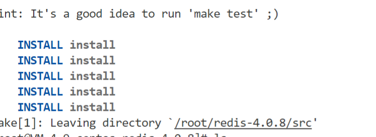

4、进入`redis-4.0.8`可以看到redis的配置文件`redis.conf`

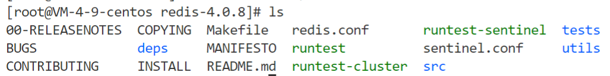

5、`redis`默认安装路径是 `/usr/local/bin`

> 在该目录下可以看到redis的客户端和服务端

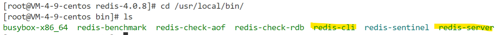

6、进⼊ `utils` ⽬录，并执⾏`install_server.sh`

```sh
[root@VM-4-9-centos redis-4.0.8]# cd utils/
[root@VM-4-9-centos utils]# ./install_server.sh 
```

> 全部执行默认操作，也可以根据自己需求更改

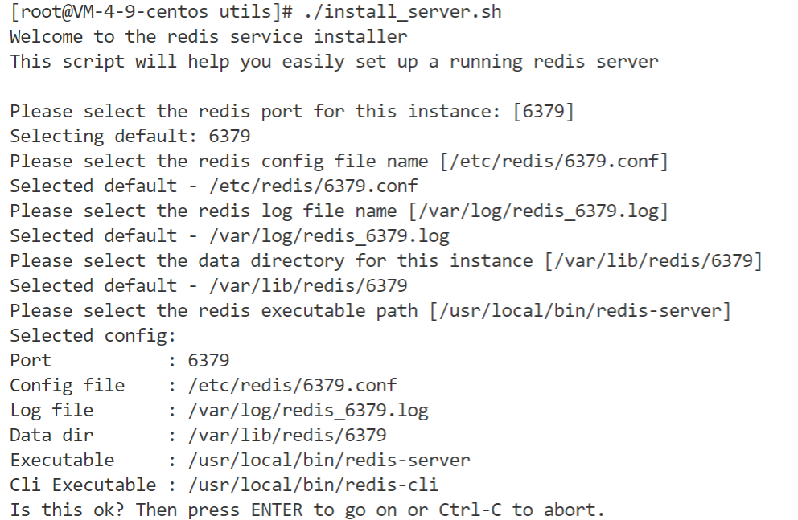

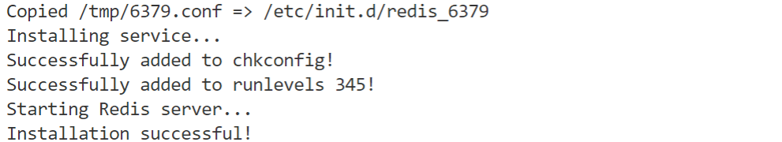

7、查看`redis`的启动结果：

```sh
[root@VM-4-9-centos utils]# systemctl status redis_6379.service
```

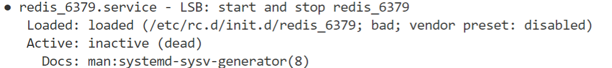

8、启动`redis`客户端并测试

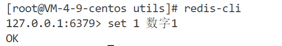

9、设置访问密码

> 打开配置文件，找到`#requirepass foobared`字段

```sh
[root@VM-4-9-centos utils]# vim /etc/redis/6379.conf
```

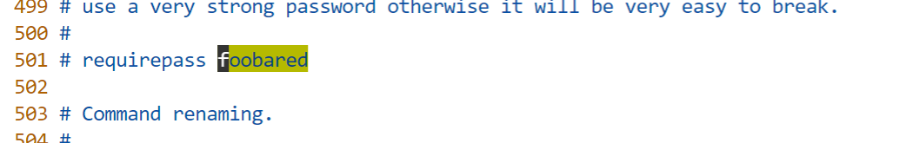

> 去掉注释，将 foobared 修改为⾃⼰想要的密码，保存即可。

```sh
requirepass ********
```

> 保存，重启 redis 服务

```sh
systemctl restart redis_6379.service
```

10、重新连接

> 这时就会通知你使用密码登陆才能使用

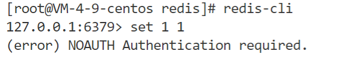

> 注意：如果你将redis服务的进程杀死，记得`redis-server`一下，如：

```sh
redis-server /etc/redis/6379.conf 
```

#### Redis的基本数据类型

1、`Redis`支持5种核心的数据类型，分别是字符串、哈希、列表、集合、有序集合：

- `String`类型
  - 字符串
- `List`类型
  - 存储多个`string`字符串的
- `Set`类型
  - 集合
    - `stl`集合
      - 默认是排序的, 元素不重复
    - `redis`集合
      - 元素不重复, 数据是无序的
- `SortedSet`类型
  - 排序集合, 集合中的每个元素分为两部分
    - `[分数, 成员] -> [66, ''tom'']`
- Hash类型
  - 跟map数据组织方式一样: key:value
    - `Qt -> QHash, QMap`
    - `Map -> 红黑树`
    - `hash -> 数组`
      - `a[index] = xx`

2、redis中数据的组织格式

- 键值对
  - `key`: 必须是字符串 - "***"
  - `value`: 可选的
    - `String`类型
    - `List`类型
    - `Set`类型
    - `SortedSet`类型
    - `Hash`类型

#### Redis的常用命令

- **String类型**

  ```shell
  # 设置一个键值对->string:string
  SET key value
  # 通过key得到value
  GET key
  # 同时设置一个或多个 key-value 对
  MSET key value [key value ...]
  # 同时查看过个key
  MGET key [key ...]
  # 如果 key 已经存在并且是一个字符串， APPEND 命令将 value 追加到 key 原来的值的末尾
  # key: hello, value: world, append: 12345
  APPEND key value
  # 返回 key 所储存的字符串值的长度
  STRLEN key
  # 将 key 中储存的数字值减一。
  # 前提, value必须是数字字符串 -"12345"
  DECR key
  ```

- **List类型 - 存储多个字符串**

  ```shell
  key -> string
  value -> list
  # 将一个或多个值 value 插入到列表 key 的表头
  LPUSH key value [value ...]
  # 将一个或多个值 value 插入到列表 key 的表尾 (最右边)。
  RPUSH key value [value ...]
  # list中删除元素
  LPOP key # 删除最左侧元素
  RPOP key # 删除最右侧元素
  # 遍历
  LRANGE key start stop
  	start: 起始位置, 0
  	stop: 结束位置, -1
  # 通过下标得到对应位置的字符串
  LINDEX key index
  # list中字符串的个数
  LLEN key
  ```

- **Set类型**

  ```shell
  key -> string
  value -> set类型 ("string", "string1")
  # 添加元素
  # 将一个或多个 member 元素加入到集合 key 当中，已经存在于集合的 member 元素将被忽略
  SADD key member [member ...]
  # 遍历
  SMEMBERS key
  # 差集
  SDIFF key [key ...]
  # 交集
  SINTER key [key ...]
  # 并集
  SUNION key [key ...]
  ```

- **SortedSet 类型**

  ```shell
  key -> string
  value -> sorted ([socre, member], [socre, member], ...)
  # 添加元素
  ZADD key score member [[score member] [score member] ...]
  # 遍历
  ZRANGE key start stop [WITHSCORES] # -> 升序集合
  ZREVRANGE key start stop [WITHSCORES] # -> 降序集合
  # 指定分数区间内元素的个数
  ZCOUNT key min max
  ```

- **Hash类型**

> Redis hash 是一个 string 类型的 field（字段） 和 value（值） 的映射表，hash 特别适合用于存储对象。
>
> Redis 中每个 hash 可以存储 232 - 1 键值对（40多亿）。

```shell
key ->string
value -> hash ([key:value], [key:value], [key:value], ...)
# 添加数据
HSET key field value
# 取数据
HGET key field
# 批量插入键值对
HMSET key field value [field value ...]
# 批量取数据
HMGET key field [field ...]
# 删除键值对
HDEL key field [field ...]
```

Key 相关的命令

```shell
# 删除键值对
DEL key [key ...]
# 查看key值
KEYS pattern
查找所有符合给定模式 pattern 的 key 。
KEYS * 匹配数据库中所有 key 。
KEYS h?llo 匹配 hello ， hallo 和 hxllo 等。
KEYS h*llo 匹配 hllo 和 heeeeello 等。
KEYS h[ae]llo 匹配 hello 和 hallo ，但不匹配 hillo
# 给key设置生存时长
EXPIRE key seconds
# 取消生存时长
PERSIST key
# key对应的valued类型
TYPE key
```

#### redis数据持久化

> 持久化: 数据从内存到磁盘的过程

持久化的两种方式:

- `rdb`方式
  - 这是一种默认的持久化方式, 默认打开
  - 磁盘的持久化文件xxx.rdb
  - 将内存数据以二进制的方式直接写入磁盘文件
  - 文件比较小, 恢复时间短, 效率高
  - 以用户设定的频率 -> 容易丢失数据
  - 数据完整性相对较低
- `aof`方式
  - 默认是关闭的
  - 磁盘的持久化文件xxx.aof
  - 直接将生成数据的命令写入磁盘文件
  - 文件比较大, 恢复时间长, 效率低
  - 以某种频率 -> 1sec
  - 数据完整性高

```shell
# rdb的同步频率, 任意一个满足都可以
save 900 1
save 300 10
save 60 10000
# rdb文件的名字
dbfilename dump.rdb
# 生成的持久化文件保存的那个目录下, rdb和aof
dir ./ 
# 是不是要打开aof模式
appendonly no
 -> 打开: yes
# 设置aof文件的名字
appendfilename "appendonly.aof"
# aof更新的频率
# appendfsync always
appendfsync everysec
# appendfsync no
```

1. `aof`和`rdb`能不能同时打开?

   - 可以

2. `aof`和`rdb`能不能同时关闭?

   - 可以

   - `rdb`如何关闭?

     ```shell
     save ""
     ```

3. 两种模式同时开启, 如果要进行数据恢复, 如何选择?

   - 效率上考虑:  `rdb`模式
   - 数据的完整性: `aof`模式

#### C++ 使用Redis

**1、hiredis的安装及解压**

- 下载地址: <http://redis.cn/clients.html#c> 

- 解压

  * ```sh
    [root@VM-4-9-centos ~]# unzip hiredis-master.zip -d hiredis
    ```

* 安装

  * ```sh
    [root@VM-4-9-centos ~]# make && make install
    ```

**2、hiredis API接口的使用**

- 连接数据库

  ```c
  // 连接数据库
  redisContext *redisConnect(const char *ip, int port);
  redisContext *redisConnectWithTimeout(const char *ip, 
                                        int port, const struct timeval tv);
  ```

- 执行redis命令函数

  ```c
  // 执行redis命令
  void *redisCommand(redisContext *c, const char *format, ...);
  // redisCommand 函数实际的返回值类型
  typedef struct redisReply {
      /* 命令执行结果的返回类型 */
      int type; 
      /* 存储执行结果返回为整数 */
      long long integer;
      /* str变量的字符串值长度 */
      size_t len;
      /* 存储命令执行结果返回是字符串, 或者错误信息 */
      char *str;
      /* 返回结果是数组, 代表数据的大小 */
      size_t elements;
      /* 存储执行结果返回是数组*/
      struct redisReply **element;
  } redisReply;
  redisReply a[100];
  element[i]->str
  ```

  | 状态表示                 | 含义                                                         |
  | ------------------------ | ------------------------------------------------------------ |
  | REDIS_REPLY_STRING==1    | 返回值是字符串,字符串储存在redis->str当中,字符串长度为redi   |
  | REDIS_REPLY_ARRAY== 2    | 返回值是数组，数组大小存在redis->elements里面，数组值存储在redis->element[i]里面。数组里面存储的是指向redisReply的指针，数组里面的返回值可以通过redis->element[i]->str来访问，数组的结果里全是type==REDIS_REPLY_STRING的redisReply对象指针。 |
  | REDIS_REPLY_INTEGER == 3 | 返回整数long long，从integer字段获取值                       |
  | REDIS_REPLY_NIL==4       | 返回值为空表示执行结果为空                                   |
  | REDIS_REPLY_STATUS ==5   | 返回命令执行的状态，比如set foo bar 返回的状态为OK，存储在str当中 reply->str == "OK" 。 |
  | REDIS_REPLY_ERROR ==6    | 命令执行错误,错误信息存放在 reply->str当中。                 |

- 释放资源

  ```c
  // 释放资源
  void freeReplyObject(void *reply);
  void redisFree(redisContext *c);
  ```

**3、实例**

```cpp
#include <stdio.h>
#include <hiredis.h>


int main() {
    //1、连接redis服务器
    redisContext* conn = redisConnect("127.0.0.1", 6379);
    if (conn->err != 0) {
        return -1;
    }
    
    //2、执行redis命令
    void *ptr = redisCommand(conn, "AUTH %s", "**此处是你设置的密码**");
    redisReply* ply = (redisReply*)ptr;

    if (ply->type == REDIS_REPLY_ERROR)
    {
        printf("Redis认证失败！\n");
    }
    else
    {
        printf("Redis认证成功！\n");
    }

    //freeReplyObject(ply);

    ptr = redisCommand(conn, "hmset user userName zhangsan passwd 123456 age 23 sex man");
    if (ply->type = 5) {
        //状态输出
        printf("状态：%s\n", ply->str);
    }
    
    //3、从数据库中读数据
    ptr = redisCommand(conn, "hgetal user");
    ply = (redisReply*)ptr;
    if (ply->type == 2) {
        //遍历
        int i;
        for (i = 0; i < ply->elements; i += 2) {
            printf("key: %s, value: %s\n", ply->element[i], ply->element[i++]);
        }
    }
    freeReplyObject(ply);

    redisFree(conn);
    return 0;
}

```

> 编译

```sh
gcc redis_test.c -I/usr/local/include/hiredis -lhiredis
```

> 进入 redis 中进行查看

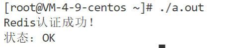

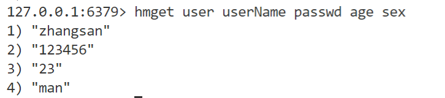